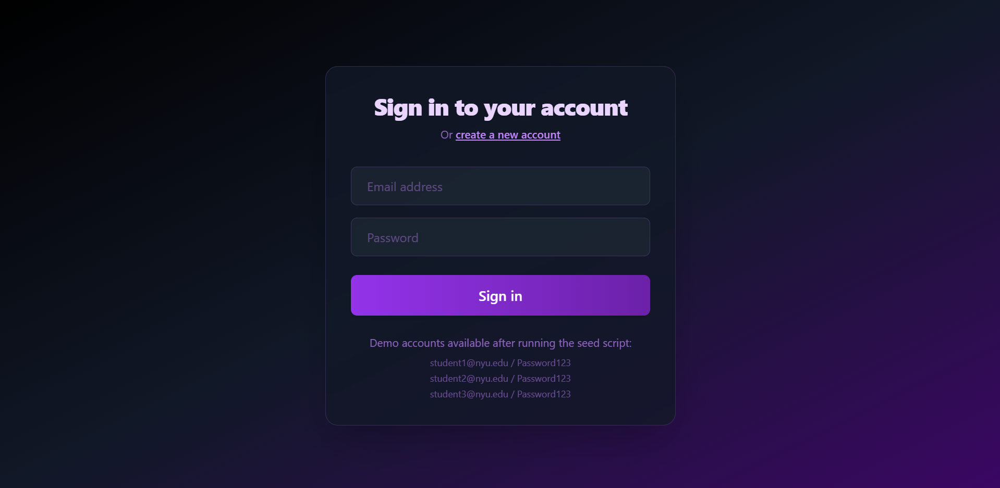
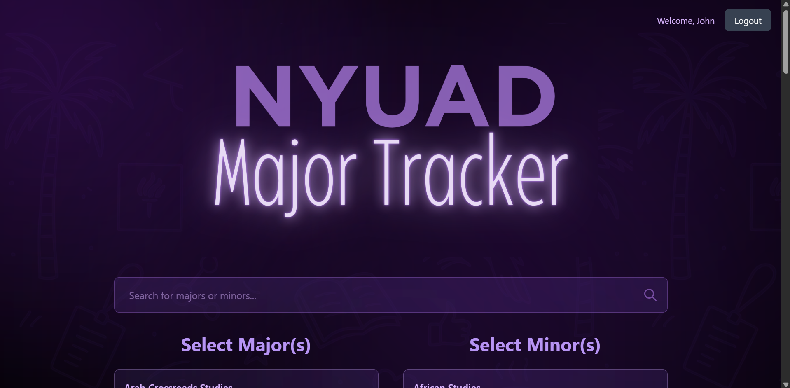
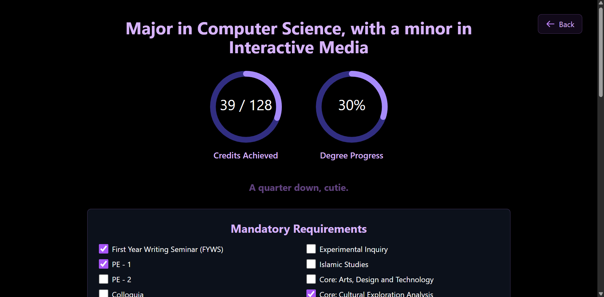
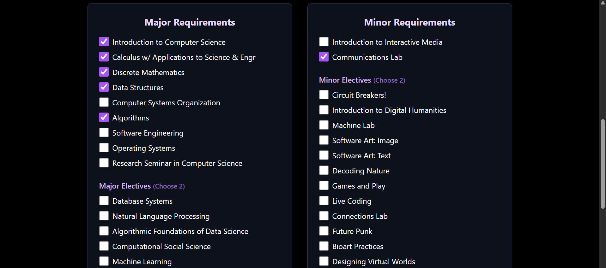
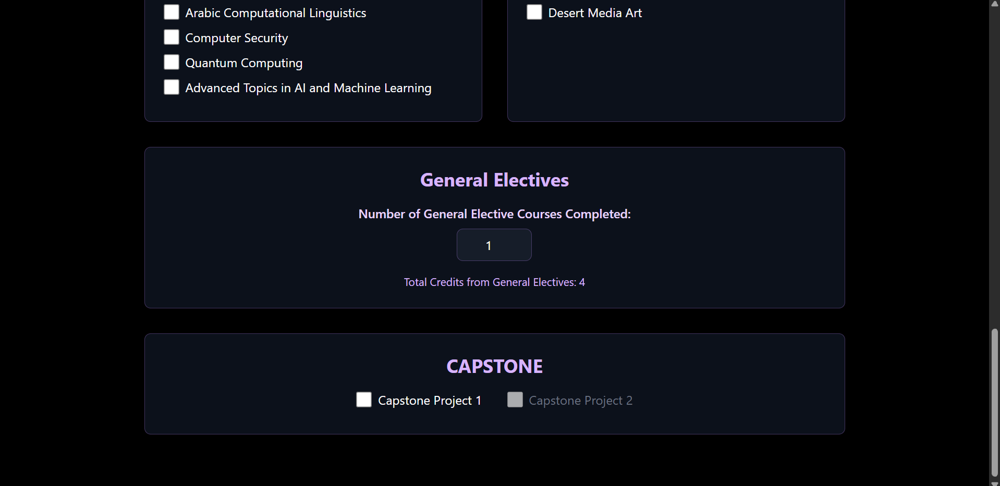

# 🎓 NYUAD Major Tracker

A comprehensive web application for NYU Abu Dhabi students to track their academic progress, manage major/minor selections, and monitor their degree completion.

## 🚀 Features

### Frontend (React + TypeScript)
- **Modern UI/UX** with Tailwind CSS and responsive design
- **Real-time progress tracking** with visual indicators
- **Interactive course selection** with search functionality
- **Progress visualization** with charts and statistics
- **Secure authentication** with JWT tokens

### Backend (Node.js + Express + MongoDB)
- **RESTful API** with comprehensive endpoints
- **JWT-based authentication** with secure password hashing
- **MongoDB database** for persistent data storage
- **Input validation** and error handling
- **Rate limiting** and security headers
- **CORS configuration** for cross-origin requests

### Core Functionality
- **User Registration & Login** with secure authentication
- **Major/Minor Selection** with validation rules (according to the university)
- **Course Progress Tracking** with completion status
- **Degree Completion Calculator** with percentage tracking
- **Data Persistence** across sessions and devices
- **Real-time Updates** with immediate feedback
- **Cute-milestone Messages** to make you feel good :)

## 🛠️ Tech Stack

### Frontend
- **React** with TypeScript
- **Vite** for fast development and building
- **Tailwind CSS** for styling
- **React Router** for navigation
- **React Context** for state management

### Backend
- **Node.js** with Express.js
- **MongoDB** with Mongoose ODM
- **JWT** for authentication
- **bcryptjs** for password hashing
- **express-validator** for input validation
- **Helmet** for security headers
- **CORS** for cross-origin requests

## 📦 Installation & Setup

### Prerequisites
- Node.js (v16 or higher)
- MongoDB (local or Atlas)
- npm or yarn

### Quick Start

1. **Clone the repository**
   ```bash
   git clone <https://github.com/siyonaaa/NYUAD-Major-Tracker.git>
   cd NYUAD-Major-Tracker
   ```

2. **Install dependencies**
   ```bash
   # Frontend dependencies
   npm install
   
   # Backend dependencies
   cd backend
   npm install
   cd ..
   ```

3. **Configure environment**
   ```bash
   cd backend
   cp env.example .env
   # Edit .env with your MongoDB URI and JWT secret
   ```

4. **Start the application**
   ```bash
   # Terminal 1: Start backend
   cd backend
   npm run dev
   
   # Terminal 2: Start frontend
   npm run dev
   ```

5. **Access the application**
   - Frontend: http://localhost:5173
   - Backend API: http://localhost:5000

### Database Setup

**Option 1: Local MongoDB**
```bash
# Install and start MongoDB locally
mongod
```

**Option 2: MongoDB Atlas**
1. Create account at [MongoDB Atlas](https://www.mongodb.com/atlas)
2. Create cluster and get connection string
3. Update `MONGODB_URI` in backend `.env`

### Seed Database (Optional)
```bash
cd backend
npm run seed
```

Creates test users:
- student1@nyu.edu / Password123
- student2@nyu.edu / Password123
- student3@nyu.edu / Password123


## 🏗️ Project Structure

```
NYUAD-Major-Tracker/
├── src/                          # Frontend source code
│   ├── components/               # React components
│   ├── contexts/                 # React contexts
│   ├── pages/                    # Page components
│   ├── utils/                    # Utility functions
│   └── assets/                   # Static assets
├── backend/                      # Backend source code
│   ├── config/                   # Configuration files
│   ├── controllers/              # Route controllers
│   ├── middleware/               # Express middleware
│   ├── models/                   # MongoDB models
│   ├── routes/                   # API routes
│   └── scripts/                  # Utility scripts
├── public/                       # Public assets
├── images/                       # Images for README
└── package.json                  # Frontend dependencies
```

## 🔐 Security Features

- **JWT Authentication** with secure token management
- **Password Hashing** using bcryptjs
- **Input Validation** with express-validator
- **Rate Limiting** to prevent abuse
- **Security Headers** with Helmet.js
- **CORS Protection** for cross-origin requests
- **Environment Variables** for sensitive data

## 🎯 Key Features

### User Management
- Secure registration and login
- JWT-based session management
- User profile management

### Academic Tracking
- Major and minor selection
- Course completion tracking
- Progress visualization
- Degree completion percentage

### Data Persistence
- MongoDB database storage
- Real-time synchronization
- Cross-device data access

## ⚠️ Important Limitation

The project does not currently contain the full inventory of courses provided at NYU Abu Dhabi, so many majors will appear empty on selection. 

## ✨ End Product

- The Landing page, where you can log into your account


- This where you choose your degree combinations. The allowed combinations are 1 MAJ + 1 MIN, 2 MAJ, or 1 MAJ + 2 MIN


- An example of how choosing a major in Comp Sci with a minor in Interactive Media would look





